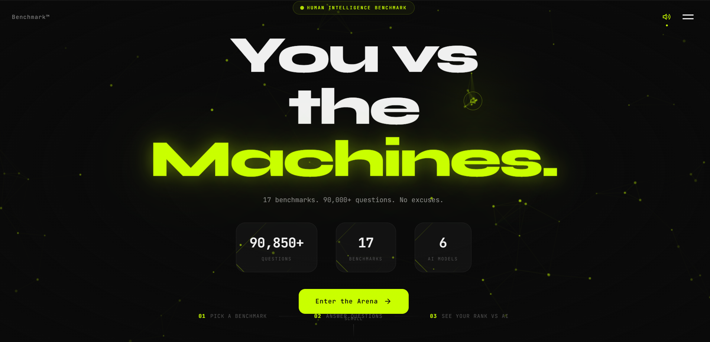
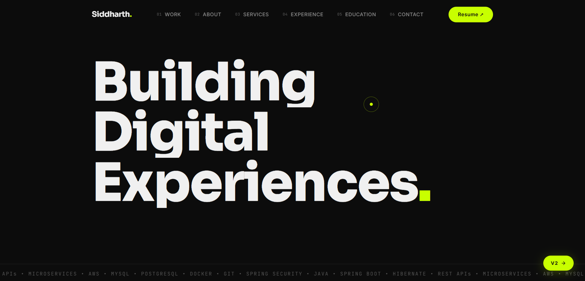
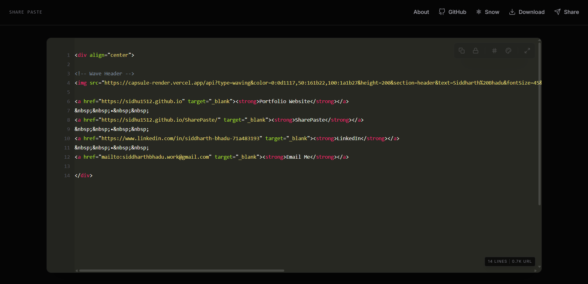

<!-- Wave Header -->

<a href="https://sidhu1512.github.io" target="_blank"><strong>Portfolio Website</strong></a>
&nbsp;&nbsp;•&nbsp;&nbsp;
<a href="https://sidhu1512.github.io/SharePaste/" target="_blank"><strong>SharePaste</strong></a>
&nbsp;&nbsp;•&nbsp;&nbsp;
<a href="https://www.linkedin.com/in/siddharth-bhadu-71a483193" target="_blank"><strong>LinkedIn</strong></a>
&nbsp;&nbsp;•&nbsp;&nbsp;
<a href="mailto:siddharthbhadu.work@gmail.com" target="_blank"><strong>Email Me</strong></a>
&nbsp;&nbsp;•&nbsp;&nbsp;

 

<table>
<tr>
<td width="50%" valign="top">
  
</td>
<td width="50%" valign="center">
  
</td>
</tr>
</table>

---

<table>
<tr>
<td valign="top" width="60%">

## About Me

Software Engineer with 2+ years of experience, currently at **Oqulto Technologies** and previously at **Capgemini**. I build scalable backend systems, optimize APIs, and automate workflows using Java and Spring Boot. I also enjoy tinkering with low-level systems and building cool side projects in my free time.

</td>
<td valign="top" width="40%">

  
   
  

</td>
</tr>
</table>

---

## Projects

 

### [Benchmark -- You vs the Machines](https://github.com/sidhu1512/howSMARTERyouARE)

A human intelligence benchmarking platform with 90,850+ questions across 17 benchmarks and 6 AI models. Pick a benchmark, answer questions, and see how you rank against AI. Built with a premium dark UI, real-time scoring, and immersive sound design.

&nbsp;
&nbsp;
&nbsp;
&nbsp;

 

---

 

### [Portfolio -- Building Digital Experiences](https://sidhu1512.github.io)

A personal portfolio website with an editorial dark design, oversized typography, and smooth animations. Showcases work, services, experience, and education with a modern, premium feel.

&nbsp;
&nbsp;
&nbsp;

 

---

 

### [SharePaste -- Instant Code Sharing](https://sidhu1512.github.io/SharePaste/)

A sleek, instant code-sharing tool with syntax highlighting, download support, and a snow-themed dark UI. Paste your code, share the link -- no sign-up needed.

&nbsp;
&nbsp;
&nbsp;

 

---

 

### More Projects

| Project | Description | Tech |
|---------|-------------|------|
| [**Chip-8 Emulator**](https://github.com/sidhu1512/chip-8) | Fully functional Chip-8 virtual machine with 35-opcode instruction set. Runs classic 8-bit games. | `Java` `CPU Emulation` |
| [**Local AI Chatbot**](https://github.com/sidhu1512/ollama-chatbot) | Private, real-time chatbot powered by a locally-run Ollama LLM via Spring Boot and WebSockets. | `Spring Boot` `WebSockets` `Ollama` |
| [**AI Recipe Assistant**](https://github.com/sidhu1512/recipe-assistant) | Generates unique recipes from user-provided ingredients using Grok generative AI API. | `Spring Boot` `REST API` `Grok AI` |

---

## Tech Stack
<picture> </picture>

#### Languages:
&nbsp;
&nbsp;
&nbsp;
&nbsp;

#### Backend & Frameworks:
&nbsp;
&nbsp;
&nbsp;
&nbsp;
&nbsp;
&nbsp;
&nbsp;

#### Databases:
&nbsp;
&nbsp;

#### DevOps & Cloud:
&nbsp;
&nbsp;
&nbsp;
&nbsp;

#### Tools & More:
&nbsp;
&nbsp;
&nbsp;

---

## GitHub Streak

 

---

  

---

## Let's Connect!

<!-- Wave Footer -->

